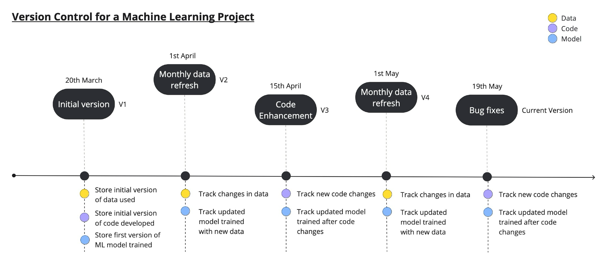
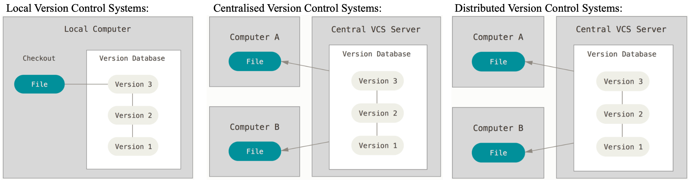
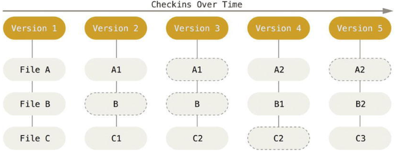
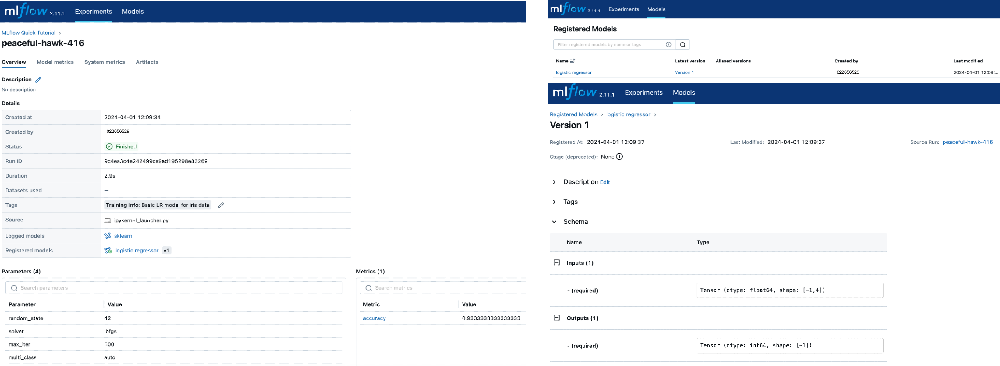
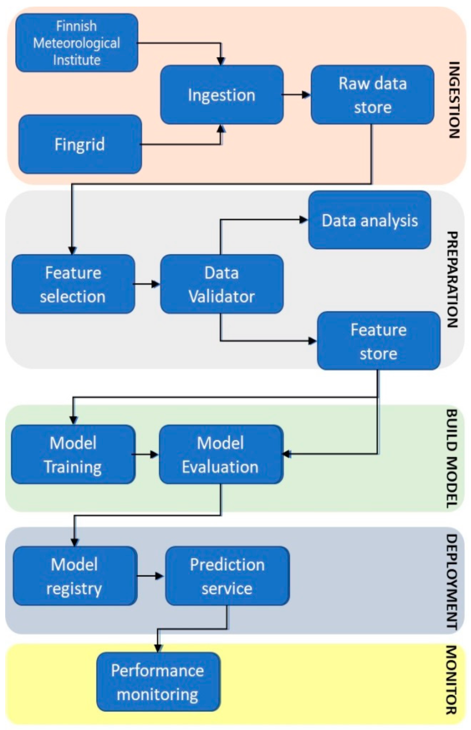

**Enhancing** **Machine** **Learning** **(ML)Accountability** **with**
**Version** **Control**

**The** **Importance** **ofAccountability** **and** **Reproducibility**
**in** **Data** **Science**

Imagine a scenario: a team of data scientists in the company has
developed a cutting-edge machine learning forecast model for residential
energy consumption. Stakeholders are impressed, and these predictions
inform crucial decisions, including resource allocation and energy
pricing. However, an internal audit raises an important question: Can
the forecasts from the last quarter be reproduced for verification? The
team scrambles to replicate their results but finds it challenging due
to inadequate tracking of data and model iterations. This predicament
would jeopardise the credibility of the predictions as well as the trust
of stakeholders.

Although this is only a hypothetical situation, it represents a genuine
risk that businesses face when machine learning models are not managed
with thorough accountability. Energy companies are entering a new era
where business decisions are increasingly driven by data science
insights. Therefore, being able to validate and track the lineage of
data, code, and models for the reproducibility, transparency, and
explainability of machine learning forecasts is more than simply good
practice; it is a critical necessity to maintain the business's
integrity and existence.

**Introducing** **MLVersion** **Control**

Version control is akin to maintaining a detailed change log, tracking,
and managing changes to a file or set of files over time so that
specific versions can be recalled later. For machine learning, this
means keeping a detailed history of data, code, and model changes as
illustrated in Figure 1.

**Why** **Does** **Version** **Control** **in** **MLMatter?**

> • **Improves** **Transparency** **and** **Traceability**: Version
> control creates a digital trail of breadcrumbs. It keeps a record of
> the modifications, encapsulating the who, what, when, and why—ensuring
> full visibility into the changes made throughout an ML project's
> lifecycle.
>
> • **Collaboration** **Boost**: By maintaining an orderly log of
> versioned data, code, and models, teams can develop simultaneously and
> merge their changes with clarity, fostering a collaborative
> environment.
>
> • **Ensures** **Reproducibility:** Reproducibility is crucial for
> ensuring the integrity and credibility of the results, the ability to
> perform root cause analysis, and the facilitation of peer review and
> collaboration across teams. Rigorous version control ensures that
> every model and experiment can be recreated, cementing the foundation
> for reproducibility.

Reflecting on our initial
hypothetical scenario, if ML version control is in place, the data
science team could effortlessly backtrack to the original data, code,
and models that generated the forecasts, allowing them to reconstruct
the model and understand any variances between the previous and latest
results, thereby reinforcing stakeholder confidence in the ML processes.

> *Figure* *1:* *Example* *of* *version* *control* *timeline* *for*
> *machine* *learning,* *illustrating* *the* *journey* *of* *a*
> *machine* *learning* *project* *managed* *with* *version* *control*
> *(methodically* *logs* *and* *tracks* *data,* *code,* *and* *model*
> *changes* *over* *time).*

**Introductory** **Tutorial** **on** **Version** **Control** **in**
**Machine** **Learning** **(ML)**

**Introduction**

In the rapidly evolving field of data science, especially in the energy
sector, the ability to manage and track changes in machine learning (ML)
projects is crucial. Whether you’re leveraging ML to forecast energy
demand, optimise power generation, or detect energy theft, ML version
control plays a critical role in ensuring the reproducibility,
transparency, and accountability of the ML project.

This document is designed for data scientists, data engineers and ML
engineers in the company, with the goal of providing a comprehensive
understanding of ML version control and its significance to building and
maintaining robust ML systems. By the end of this tutorial, you will not
only grasp the fundamental concepts of version control in ML but also
learn how to apply version control of data, code, and models to your
daily work in data science and machine learning.

**Table** **of** **Contents**

*1.* *Introduction* *to* *Version* *Control*
*...................................................................................................................................2*
*2.* *Version* *Control* *in* *Software* *Engineering* *vs* *Machine*
*Learning*
*.................................................................................3*
*3.* *Benefits* *of* *Versioning* *in*
*ML........................................................................................................................................3*
*4.* *Version* *Control* *for* *Code*
*.............................................................................................................................................4*
*5.* *Version* *Control* *for*
*Data..............................................................................................................................................5*
*6.* *Version* *Control* *for*
*Model............................................................................................................................................6*
*7.* *Practical* *Application* *in* *the* *Energy*
*Sector..................................................................................................................7*
*8.*
*Conclusion....................................................................................................................................................................8*
*9.*
*Reference......................................................................................................................................................................8*
*10.*
*Appendix..................................................................................................................................................................8*

**1.** **Introduction** **to** **Version** **Control**

Version control is the process of tracking and managing changes to a
file or set of files over time. It allows us to track and trace changes,
revert to previous versions, and collaborate on projects with others.
Version control systems (VCS) is the software tools for implementing
version control and there are three main types of version control
systems:

• **Local** **Version** **Control** **Systems:** This version control
system consists of a simple database stored on a local computer that
records any changes made to files under revision control. One popular
example of this VCS is the Revision Control System (RCS), which is still
distributed with many computers today (Chacon and Straub, 2014). The
main benefit of this sort of VCS is its simplicity and low cost of
implementation. It can be deployed locally, eliminating the requirement
for external servers. However, the drawbacks are: 1) if the local
disk/database is broken or corrupted, all recorded changes will be lost;
and 2) because the changes are saved locally, it is difficult for team
members to collaborate and share information about their changes with
one another.

• **Centralised** **Version** **Control** **Systems:** This type of
version control system has a single server that stores all the versioned
files, and several clients/users that check out the files from the
central server. Examples of centralised VCS are Microsoft Team
Foundation Server, Perforce, and Subversion (SVN). With a central
repository of the versioned files that is accessible by multiple users,
centralised VCS enables team members to work in parallel and then merge
their changes afterwards with clarity, supporting team
collaboration.Additionally, administrators of the central repository can
set permissions/accesses of each user, allowing better control over who
can make changes and which parts can or cannot be changed. The downside
is that if the central server is damaged, there’s a high risk of losing
the entire history of the project (Chacon and Straub, 2014).

• **Distributed** **Version** **Control** **Systems:** In distributed
VCS, clients don't simply check out the most recent snapshot of the
files; instead, they mirror the repository, including its entire
history. This allows for more flexible collaboration and better data
integrity. Since every clone is a backup of all data, if the central
server fails or becomes corrupted, the clients' repositories can be
utilised to recover the central server's repository (Chacon and Straub,
2014). As a result, distributed VCS is the most widely used version
control system for software development today, and we will be focusing
on it for the remainder of this document. Examples of popular
distributed VCS are Git and Mercurial.

> *Figure* *1:* *Diagrams* *illustrating* *the* *different* *type* *of*
> *version* *control* *systems,* *i.e.* *local* *version* *control*
> *system,* *centralised* *version* *system,* *and* *distributed*
> *version* *control* *system,* *sourced* *from* *(Chacon* *and*
> *Straub,* *2014).*

**2.** **Version** **Control** **in** **Software** **Engineering**
**vs** **Machine** **Learning**

Machine learning has transformed the way we approach problem-solving and
decision-making in the energy sector. More and more business decisions
made by energy companies are driven by advanced ML andAI techniques. For
example, Siemens Energy started usingAI to predict when maintenance is
needed for their gas turbines, and IBM’s Watson is being used to predict
energy and supply (www.marketsandmarkets.com, n.d.). However, as much as
ML empowers us to make more informed decisions, it also introduces a
unique set of challenges that can complicate the development and
maintenance of these systems as compared to traditional software.

In software engineering,
version control is often primarily concerned with the evolution of code.
When a bug is identified or a feature misbehaves, engineers can trace
back through the code revisions to understand the changes and correct
them. The rollback process is generally straightforward, allowing for a
return to the last stable version or the revision of specific modules.
In contrast, ML systems intertwine code with data and models in a manner
that is intrinsically more complex (Sculley et al., 2015). An ML model’s
performance is tightly bound to the data it was trained on and the
specific structure of the model itself, including the hyperparameters,
features, model architecture, and algorithms applied. Discrepancies in
any of these elements, whether a slight variation in the training
dataset, a tweak in the model’s architecture, or a shift in
hyperparameters, can lead to substantially different model behaviours
and predictive outcomes. Therefore, robust version control in ML must
extend beyond code to encapsulate data and models.

> *Figure* *2:* *Example* *of* *version* *control* *timeline* *for*
> *machine* *learning,* *illustrating* *the* *journey* *of* *a*
> *machine* *learning* *project* *managed* *with* *version* *control*
> *(methodically* *logs* *and* *tracks* *data,* *code,* *and* *model*
> *changes* *over* *time).*

**3.** **Benefits** **of** **Versioning** **in** **ML**

The key benefits of implementing version control of data, code, and
models for ML are:

> • **Transparency** **and** **Traceability**: By keeping a record of
> the modifications to the data, code, and models (as depicted in Figure
> 2), including information about the who, what, when, and why, it
> provides the team full transparency and traceability of all changes
> made throughout an ML project's lifecycle.
>
> • **Collaboration:** Implementing version control allows multiple team
> members to collaborate and develop simultaneously and then merge their
> changes with clarity, enabling more efficient teamwork.
>
> • **Reproducibility**: Reproducibility is critical for guaranteeing
> the results' integrity and credibility, doing root cause analysis, and
> facilitating peer review and cross-team collaboration. Rigorous
> version control of data, code, and models helps ensure that previous
> models and experiments can be recreated, cementing the foundation for
> reproducibility.

**4.** **Version** **Control** **for**
**Code**

Whether it is traditional software development or building a machine
learning system, tracking and managing code changes and effective
collaboration are crucial to the success of a project. Version control
systems are essential tools for this, with Git being one of the most
widely adopted tools for code versioning.

**How** **does** **Git** **work?**

Git is a free and open-source distributed version control system that is
widely used for tracking code changes, enabling multiple developers to
work on a single project without interfering with each other’s work.
Every time a developer commits or saves the state of the project, Git
takes a picture of all the files in the repository at that moment and
stores a reference to that snapshot. If some of the files have not
changed, Git doesn’t store the same file again but just a link to the
previous identical file it has already captured as demonstrated in
Figure 3. Git has three main states in which files can reside: modified,
staged, and committed. *Modified* means the changes are not yet
committed to the local database; *staged* means the changed files are
marked to go into the next commit snapshot; and *committed* means the
changes are stored safely in the local database (Chacon and Straub,
2014).

> *Figure* *3:* *Simplified* *flowchart* *showing* *how* *changes* *are*
> *stored* *as* *snapshots* *in* *Git,* *sourced* *from* *(Chacon* *and*
> *Straub,* *2014).*

**Short** **Git** **tutorial**

Git can be downloaded from the following website:
<u>https://www.git-scm.com/.</u> After installing Git, we will open our
Command shell to run some Git commands. For Windows users, you can use
Git bash, and for Mac or Linux users, you can use the built-in terminal.
For this tutorial, we’ll go through three fundamental Git operations:
creating a repository, committing changes, and viewing commit history.

> a\. Configure Git for the first time and create a Git repository:
>
> \# Configure your username and email for Git
>
> git config --global user.name "your-users-name"
>
> git config --global user.email "your-email@company.com"
>
> \# Create a new folder called Git-tutorial and navigate to it mkdir
> version-control-tutorial
>
> cd version-control-tutorial
>
> \# Initialise a Git repository git init
>
> b\. Add an empty *README.md* file to folder and commit the change:
>
> \# Create an empty README.md file and check if Git has detected the
> new README.md file echo "" \> README.md
>
> git status \# the README.md should be listed as untracked file
>
> \# Use the git add command to begin tracking the file and recheck git
> status git add README.md
>
> git status \# the README.md is now listed as changes to be committed
>
> \# Commit the change (add a clear and concise message for commit to
> help recall about the changes later) git commit -m "Add an empty
> README.md file"
>
> c\. View commit history:
>
> \# View commit history
>
> git log \# shows history of changes made, including who, when, and the
> commit message

**Further** **learning** **materials** **for** **Git**

For those seeking to expand their proficiency in Git, "Pro Git" by
Chacon and Straub (2014) is an invaluable resource. This comprehensive
guide delves into the origins and mechanics of Git, providing detailed
tutorials that cater to a variety of systems and use cases. On the other
hand, for learners looking for a more succinct introduction to Git, the
tutorials available at w3schools.com offer quick, practical lessons on
the fundamental operations of Git. This resource is particularly
well-suited for those who require immediate, hands-on experience with
Git for their ongoing projects and may not need an extensive theoretical
background at the outset.

**5.** **Version** **Control** **for** **Data**

When it comes to managing machine learning projects, data is as crucial
as code. Just as with code, any changes in data can dramatically affect
the outcome of the ML models. Therefore, tracking the changes in
datasets used over time plays an important role in ensuring the
integrity and reproducibility of ML models.

Below are some of the common strategies for data versioning (John,
2022):

> • Caching Complete Datasets: Each new version of a dataset is saved in
> its entirety. It is straightforward but can be storage-intensive for
> large datasets.
>
> • Storing Deltas Between Versions: Instead of storing the entire
> datasets, only the differences or "deltas" between datasets are saved.
> This method is more storage-efficient, but the reconstruction of
> specific versions of a dataset can be more complicated.
>
> • Tracking Record-Level Changes: Modifications are tracked at the
> record level. This approach is suitable for structural data with
> frequent and isolated changes at the record level, where each record's
> history is important.
>
> • Appending in Immutable Datasets: Changes are appended to an
> immutable dataset, and file size is used to track changes. This
> approach is the simplest form of data versioning and is typically used
> for log files or event stream data.
>
> • Pipeline Versioning for Derived Data: Rather than versioning the
> data, the processes or data pipelines used for generating the data are
> versioned. This approach is helpful when datasets are too large, and
> it is more efficient to regenerate them from the original data using
> the recorded transformation steps.

**A** **brief** **DVC** **tutorial**

Data Version Control (DVC) is a popular open-source tool for managing
versions of data. It tracks changes in datasets over time by caching
different versions or copies of them. DVC is designed to run alongside
Git, with Git handling code versioning and DVC managing data versioning,
and the commands and workflows in DVC resemble Git's. For this tutorial,
we will go over some of the fundamental DVC operations (using DVC’s
sample data), building on the Git project created in section 4 so that
we will not have to create a new Git repository again. Before beginning
the tutorial, make sure to install DVC with the pip command: *pip*
*install* *dvc*.

> a\. Download initial sample data and initialise DVC:
>
> \# Download DVC sample data from their GitHub repo
>
> dvc get https://github.com/iterative/dataset-registry
> tutorials/versioning/data.zip unzip -q data.zip
>
> rm -f data.zip
>
> \# Initialise DVC and add data file to DVC tracking dvc init
>
> dvc add data
>
> \# Commit the changes
>
> git add .gitignore data.dvc git commit
>
> git tag -a
>
> b\. Download additional data and commit the changes:
>
> \# Download updated sample data from DVC's GitHub repo and add the
> updated data to DVC tracking dvc get
> https://github.com/iterative/dataset-registry
> tutorials/versioning/new-labels.zip unzip -q new-labels.zip
>
> rm -f new-labels.zip dvc add data
>
> \# Commit the changes git add data.dvc
>
> git commit git tag -a
>
> c\. Revert to initial training dataset with 1000 images:
>
> \# Revert to initial dataset (1000 images for training) git checkout
> v1.0
>
> dvc checkout \# training data folder should now contains only 1000
> images

**Additional** **learning** **materials** **on** **data** **version**
**control**

The official DVC website (Data Version Control · DVC, n.d.) is an
invaluable resource for those seeking to master the implementation of
DVC. It offers extensive insights into DVC’s functionality, use cases,
and practical step-by-step tutorials, which are helpful for anyone
looking to integrate DVC into their ML projects. As DVC operates by
caching dataset versions, projects with particularly large datasets
might necessitate alternative or supplementary

tools to manage storage efficiently. For insights into the landscape of
data version control tools, the Neptune.ai blog by Zvorničanin
(Zvorničanin, 2023) is an excellent resource. The blog presents a
concise overview and comparison of leading data version control tools,
including DVC, Git LFS, Neptune.ai, Dolt, LakeFS, Delta Lake, and
Pachyderm. Furthermore, it includes brief, accessible tutorials for each
tool, which can aid in the selection and implementation of a tool that
best fits the project's scale and complexity.

**6.** **Version** **Control** **for** **Model**

In machine learning, the concept of version control extends beyond data
and code. The ML models, which are created by combining code and data,
likewise require thorough tracking and management throughout their
development lifecycle. Model version control entails maintaining a
detailed history of trained models, including information about the data
snapshots used for training, model hyperparameters, the ML algorithm
chosen, and performance metrics (Hashesh, 2022). This history is
critical for the traceability and reproducibility of ML models.

**Quick** **MLflow** **tutorial**

MLflow is a popular tool for model version control. It is an open-source
platform dedicated to managing the entire ML lifecycle, including
experimentation, reproducibility, and deployment. It offers a range of
tools for managing the end-to-end ML process. These include: MLflow
Tracking (logs ML experiments, including hyperparameters, evaluation
metrics, and outputs), MLflow Projects (organises data science code in a
reusable and reproducible format), MLflow Models (packages ML models in
a standardised form so that it is easily deployable in different
environments), and MLflow Registry (serves as the central store for
versioning and managing ML models) (www.restack.io, n.d.).

This tutorial will introduce the fundamental features of MLflow,
enabling you to get started with tracking and managing your ML models.
The tutorial will be mainly covered in Python, running locally on a
jupyter notebook. Before beginning the tutorial, make sure to install
MLflow with the pip command: *pip* *install* *mlflow*, and launch the
MLflow tracking server locally by running the following bash command on
a terminal: *mlflow* *server* *--host* *127.0.0.1* *--port* *8080.*

> a\. Import the required libraries and train a logistic regression
> model using the iris dataset from *sklearn*:
>
> import mlflow
>
> from mlflow.models import infer_signature import pandas as pd
>
> from sklearn import datasets
>
> from sklearn.model_selection import train_test_split from
> sklearn.linear_model import LogisticRegression from sklearn.metrics
> import accuracy_score
>
> \# Load the Iris dataset
>
> X, y = datasets.load_iris(return_X_y=True)
>
> \# Split the data into training and test sets
>
> X_train, X_test, y_train, y_test = train_test_split(X, y,
> test_size=0.3, random_state=42, stratify=y) \# Define the model
> hyperparameters
>
> params = {"solver": "lbfgs","max_iter": 500,"multi_class":
> "auto","random_state": 42,} \# Train the model
>
> lr = LogisticRegression(\*\*params) lr.fit(X_train, y_train)
>
> \# Predict on the test set y_pred = lr.predict(X_test) \# Calculate
> accuracy
>
> accuracy = accuracy_score(y_test, y_pred)
>
> b\. Log the details of model using MLflow:
>
> \# Set the tracking server uri for logging
> mlflow.set_tracking_uri(uri="http://127.0.0.1:8080") \# Name the
> MLflow Experiment mlflow.set_experiment("MLflow Quick Tutorial")
>
> \# Start an MLflow run with mlflow.start_run():
>
> \# Log the hyperparameters mlflow.log_params(params) \# Log the
> accuracy metric
>
> mlflow.log_metric("accuracy", accuracy)
>
> \# Set a tag that we can use to remind ourselves what this run was for
> mlflow.set_tag("Training Info", "Basic LR model for iris data")
>
> \# Infer the model signature
>
> signature = infer_signature(X_train, lr.predict(X_train)) \# Log the
> model
>
> model_info = mlflow.sklearn.log_model(sk_model=lr,
> artifact_path="iris_model", signature=signature,
> input_example=X_train, registered_model_name="logistic regressor",)
>
> c\. Access the MLflow UI at <u>http://127.0.0.1:8080</u> to view run
> details, including model parameters and performance metrics as shown
> in Figure 4. style="width:6.87942in;height:2.51944in" />

**Additional** **MLflow** **learning** **resources**

MLflow is equipped with a suite of features for managing the ML
lifecycle end-to-end. For a quick introduction to its core
functionalities, the restack.io website (www.restack.io, n.d.) offers an
accessible overview, presenting key components of MLflow and their
practical uses along with brief, user-friendly tutorials, ideal for
those new to the platform. While restack.io offers concise introduction,
it may only skim the surface of MLflow's potential. For a more detailed
study, the official MLflow documentation (mlflow.org, n.d.) is the
definitive resource. It provides thorough explanations of MLflow's
components, their applications, and demonstrates how MLflow integrates
with widely-used tools and platforms like Docker and Databricks. This
comprehensive coverage is particularly beneficial for practitioners
seeking to deepen their operational knowledge of MLflow in complex ML
projects.

> *Figure* *4:* *Screenshots* *depicting* *the* *MLflow* *UI,*
> *highlighting* *the* *detailed* *logging* *capabilities* *for*
> *machine* *learning* *experiments* *and* *models.* *It* *includes*
> *key* *information* *such* *as* *model* *versions,* *creation* *date,*
> *hyperparameters,* *model* *metrics* *and* *structure* *of* *input*
> *and* *outputs* *to* *support* *the* *tracking* *and* *management*
> *of* *ML* *models.*

**7.** **PracticalApplication** **in** **the** **Energy** **Sector**

Referencing the detailed case study by (Subramanya, Sierla and Vyatkin,
2022), this section discusses the integration of version control across
code, data, and models within a ML use case for the energy sector.

**Overview:**

A transformer-based neural
network model, specifically the Temporal Fusion Transformer, was
employed to predict one-day-ahead hourly energy prices for Finland's
Frequency Containment Reserves for Normal Operations (FCR-N) market. The
model utilized datasets from the Finnish National Grid Operator
(Fingrid) and the Finnish Meteorological Institute (FMI). This
predictive model aimed to assist Distributed Energy Resources (DERs)
owners, like those operating smart loads, photovoltaics, and wind power,
in making informed bidding decisions for the FCR-N market. The
architecture of the ML pipeline utilised is depicted in Figure 5.

**Version** **Control** **for** **Code:**

Utilising Git, the source code for the project can be managed using a
dual-branch strategy, i.e., ‘*development*’ for ongoing development and
‘*master*’ for stable releases ready production. This allowed for
continuous integration and delivery (CI/CD) practices, where changes in
the *development* branch underwent thorough testing before merging into
the *master*. With clear and meaningful tags for each release, this
approach ensures that the history of code evolution will be
well-documented, allowing the team to easily trace changes and reproduce
previous results if needed.

> *Figure* *5:* *ML* *pipeline* *for* *the* *case* *study* *presented*
> *in* *(Subramanya,*

Data Version Control (DVC) can be used alongside Git to oversee changes
*Sierla* *and* *Vyatkin,* *2022).* in data, allowing for meticulous
tracking and versioning of input data. Data

snapshots, both raw and processed (after feature selection), can be
managed by DVC, and stored remotely, for

> instance, onAWS S3 or Azure Data Lake, ensuring efficient traceability
> and project reproducibility. Regular reviews of the DVC repository
> size should be conducted to remove outdated data versions, saving
> storage costs.
>
> **Version** **Control** **for** **Model:**
>
> MLflow can be used for managing the version control for the model,
> logging the model architecture, hyperparameters, and performance
> metrics for each experiment, and the details of each run can be viewed
> via MLflow’s UI. This ensures good traceability and reproducibility
> for any model changes. Depending on the project's scalability
> requirements, models, integrated with MLflow, could be containerised
> using Docker and managed with Kubernetes or deployed on Databricks for
> enhanced scalability and management.
>
> **8.** **Conclusion**
>
> This document has systematically examined the critical role of version
> control in enhancing machine learning (ML) practices, with a
> particular emphasis on its applications within the energy sector. It
> has illuminated the necessity of version control for ensuring the
> reproducibility, transparency, and accountability that underpins
> reliable ML operations. By delving into the specifics of version
> control for code using Git, for data employing DVC, and for models via
> MLflow, the document has provided practitioners with practical and
> actionable guidance to incorporate these version control systems into
> their ML workflows effectively.
>
> As the field of data science continues to grow and evolve,
> particularly in applications such as energy demand forecasting and
> resource optimization for the energy sector, the need for robust ML
> version control becomes increasingly evident. This document is
> designed to equip ML practitioners with a foundational understanding
> of version control for data, code, and models, enabling them to foster
> robust ML version control practices on their projects, thereby
> bolstering the reproducibility, accountability, and integrity of their
> ML initiatives.
>
> **9.** **Reference**
>
> i\. Chacon, S. and Straub, B. (2014). Pro Git. Berkeley, Ca: Apress.
>
> ii\. Sculley, D., Holt, G., Golovin, D., Davydov, E., Phillips, T.,
> Ebner, D., Chaudhary, V., Young, M., Crespo, J.-F. and Dennison, D.
> (2015). Hidden Technical Debt in Machine Learning Systems. In: In
> Proceedings of the 28th International Conference on Neural Information
> Processing Systems - Volume 2 (NIPS’15). Cambridge, MA.: MIT Press.
>
> iii\. John, B. (2022). Version Control for Machine Learning and Data
> Science. neptune.ai. Available at:
> <u>https://neptune.ai/blog/version-control#:~:text=Version%20control%20tracks%20and%20manages.</u>
>
> iv\. Data Version Control · DVC. (n.d.). Tutorial: Data and Model
> Versioning. Available at:
> <u>https://dvc.org/doc/use-cases/versioning-data-and-models/tutorial.</u>
>
> v\. Hashesh, A. (2022). Version Control for ML Models: Why You Need
> It, What It Is, How to Implement It. \[online\] neptune.ai. Available
> at: <u>https://neptune.ai/blog/version-control-for-ml-models</u>.
>
> vi\. mlflow.org. (n.d.). MLflow Documentation — MLflow 2.2.2
> documentation. Available at:
> <u>https://mlflow.org/docs/latest/index.html.</u>
>
> vii\. Subramanya, R., Sierla, S. and Vyatkin, V. (2022). From DevOps
> to MLOps: Overview and Application to Electricity Market Forecasting.
> Applied Sciences, \[online\] 12(19), p.9851. doi:
> <u>https://doi.org/10.3390/app12199851.</u>

viii\. www.marketsandmarkets.com. (n.d.). AI-Powered Energy Sector in
2023: Products, Companies, and Innovations. Available at:
<u>https://www.marketsandmarkets.com/industry-news/AI-Powered-Energy-Sector-in-2023-Products-Companies-and-Innovations#:~:text=Top%20companies%20that%20are%20adopting%20AI%20for%20energy%20consumptio</u>
<u>n</u>.

> ix\. www.w3schools.com. (n.d.). Git Tutorial. Available at:
> <u>https://www.w3schools.com/git/default.asp?remote=github</u>.
>
> x\. Zvorničanin, E. (2023). How to Version Control Data in ML for
> Various Data Sources. \[online\] neptune.ai. Available at:
> <u>https://neptune.ai/blog/data-versioning-control-for-various-data-sources</u>.
>
> xi\. www.restack.io. (n.d.). *MLflow* *Open* *Source* *Overview*.
> Available at:
> <u>https://www.restack.io/docs/mlflow-knowledge-mlflow-open-source-intro#clpe0dphd05zgxh0tsedri9jm.</u>
>
> **10.** **Appendix**
>
> The datasets and full Python codes used in the coding tutorials of
> this document can be accessed in the following GitHub repository:
> <u>https://github.com/jzkhong/ml-version-control.</u>
